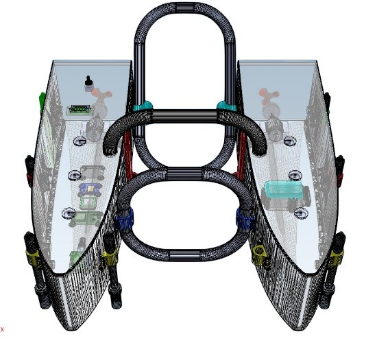
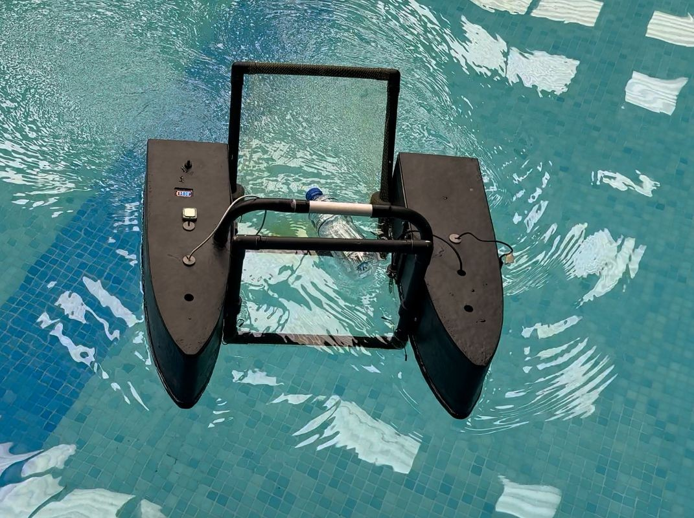

# BlueShield-USV-for-Water-Quality-Monitoring-Heavy-Metal-Contamination-Prediction

BlueShield is an Unmanned Surface Vehicle (USV) designed to monitor water quality across large water bodies and predict heavy metal contamination using machine learning. The system combines IoT sensors, long-range communication, and data analytics to provide a cost-effective and scalable solution for environmental monitoring and sustainability.

## Overview

Traditional water quality monitoring relies on manual sampling and laboratory testing, which is expensive, time-consuming, and limited to specific sampling points. BlueShield addresses these challenges by deploying a mobile sensing platform capable of collecting real-time water quality data while navigating across the water surface. The collected parameters are used by machine learning models to predict heavy metal concentrations, reducing the need for costly lab analysis.

## Key Features

- Multi-parameter water monitoring including:
  pH
  Electrical Conductivity (EC)
  Total Dissolved Solids (TDS)
  Temperature
  Dissolved Oxygen (DO)
- Machine Learning–based prediction of heavy metal concentrations such as Arsenic, Lithium, and Barium. 
- 6330_FYPreport_FINAL FINAL
- LoRa-based long-range communication for transmitting sensor data.
- Web dashboard for real-time visualization, graphs, and GPS tracking.
- Surface trash collection mechanism integrated into the USV design.

## System Architecture

The BlueShield system consists of the following main components:
### 1. USV Hardware Platform
   Microcontroller: ESP32
   GPS module for location tracking
   Water quality sensors (pH, EC, TDS, Temperature, DO)
   LiPo battery powered propulsion system
### 2. Communication Network
  LoRa modules used for long-range, low-power data transmission.
### 3. Backend & Data Processing
  Sensor data transmitted to a backend server.
  Machine learning models process the data to predict heavy metal concentrations.
  ### 4. Web Application
  Displays real-time sensor readings.
  Shows predicted heavy metal levels.
  Provides live maps and historical data visualizations.

## Applications
Environmental monitoring of lakes, rivers, and reservoirs
Early detection of heavy metal contamination
Smart water management for municipalities and environmental agencies
Research and data collection for water quality studies

## Code Breakdown
- Firmware for Sensor Calibration is stored in the **sensors code** folder
- Firmware for LoRa Nodes Setup is in **LoRa Nodes** folder
- The **received_combined.cpp** file operates on a separate ESP32 or compatible microcontroller that listens for LoRa transmissions from the USV. When packets arrive, the code extracts and interprets the sensor readings and GPS data contained within them. The processed data can then be forwarded to the backend system for further use, displayed through a serial interface, or used for logging and visualization.
- The **transmitter_combined.cpp** file runs on the ESP32 mounted on the USV and is responsible for collecting and transmitting environmental data. It continuously reads measurements from onboard sensors including pH, electrical conductivity (EC), total dissolved solids (TDS), dissolved oxygen (DO), and temperature. At the same time, it retrieves location coordinates from the GPS module. The gathered information is then organized into a compact structured packet and transmitted periodically over the 433 MHz LoRa link to the ground receiver.
  
